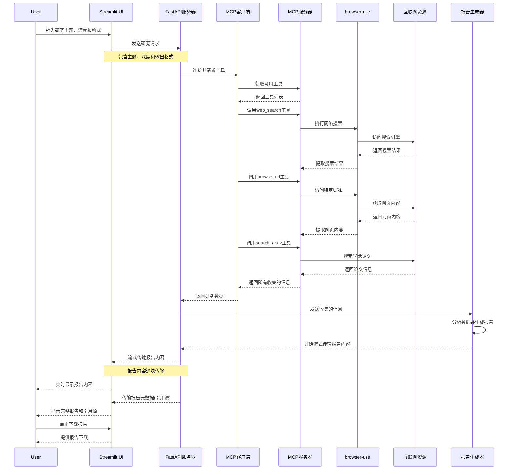

# iResearcher

## 功能介绍
### 1. 深度研究报告生成助手
- **功能描述**：
  - 该助手能够根据用户输入的研究主题和深度，生成详细的研究报告。
  - 报告内容包括：
    - 搜索结果
    - 网页内容
    - 学术论文信息
    - 引用来源
  - 支持多种输出格式，如Markdown、HTML等。
- **使用方法**：
  - 用户通过Streamlit界面输入研究主题和深度。
  - 系统会自动调用MCP客户端，连接到MCP服务器以获取工具。
  - 工具包括：
    - `web_search`：执行网络搜索
    - `browse_url`：获取特定URL的详细内容
    - `search_arxiv`：搜索学术论文
  - 收集到的信息会被分析并生成报告。
  - 报告内容会实时显示在Streamlit界面上，用户可以下载报告。

### 系统流程

这个Mermaid时序图详细展示了深度研究报告生成助手中的数据流动过程，清晰地表示了各组件之间的交互和信息传递顺序。图中描述了三个主要流程：

1. **用户请求流**：
   - 用户通过Streamlit界面输入研究主题、深度和格式
   - Streamlit将请求发送到FastAPI服务器

2. **信息收集流**：
   - FastAPI服务器连接MCP客户端并请求工具
   - MCP客户端从MCP服务器获取工具列表
   - 系统使用多种工具收集信息：
     - `web_search`工具执行网络搜索
     - `browse_url`工具获取特定URL的详细内容
     - `search_arxiv`工具搜索学术论文
   - 收集到的信息返回给FastAPI服务器

3. **报告生成流**：
   - FastAPI服务器将收集的信息发送给报告生成器
   - 报告生成器分析数据并生成报告
   - 报告内容通过流式传输方式返回给Streamlit界面
   - 用户可以实时查看报告生成过程
   - 最后传输报告元数据(如引用源)
   - 用户可以下载完整报告

这个时序图展示了系统各组件之间的精确交互顺序，特别强调了流式传输的实现，使用户能够实时看到报告生成过程，而不必等待整个报告完成。